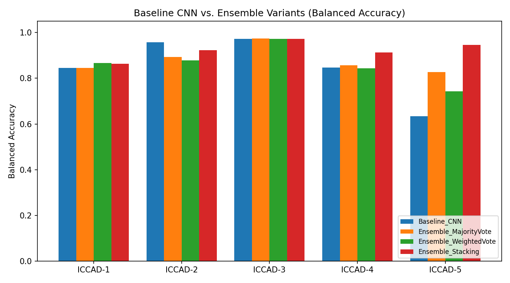
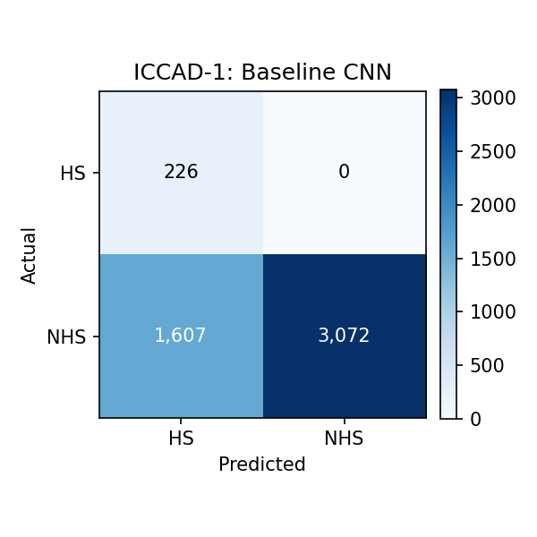
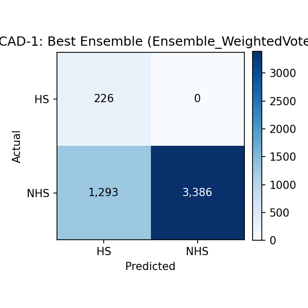
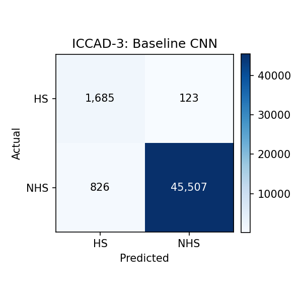
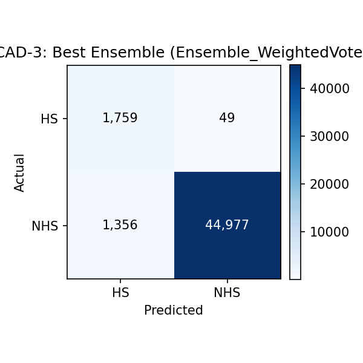

# Heterogeneous ML–DL Ensemble for Reliable Lithography Hotspot Detection on ICCAD-12 Benchmarks

[](LICENSE)
[](https://www.python.org/)
[](https://tensorflow.org/)
[](https://scikit-learn.org/)

Code, paper documentation and benchmark results for **"Heterogeneous ML–DL Ensemble for Reliable Lithography Hotspot Detection on the ICCAD-12 Benchmarks"** (Group 6, Digital Assignment II, BEVD402L).

---

## 📌 Abstract

Lithography hotspots are layout patterns that print with open or short defects during silicon fabrication. Finding them early in the physical design flow is critical because rigorous lithography simulation is computationally expensive for full-chip screening. A lightweight CNN trained from scratch was recently shown to outperform deep transfer-learning pipelines on the ICCAD-12 benchmarks.

This work investigates whether combining different learning algorithms can make hotspot detection more reliable than a standalone CNN. The ensemble consists of the CNN's own sigmoid head and an **SVM**, a **Random Forest (RF)** and an **ANN** trained on the CNN's 64-D embedding, combined by three strategies:

1. **Majority Voting (hard voting)**
2. **Weighted Soft Voting**
3. **Stacking Meta-Learner (Logistic Regression)**

Evaluated on all five official ICCAD-12 benchmarks with identical data splits, **Stacking gives the best average result**:

- **Balanced Accuracy (BA)** rises from **92.09% to 92.97%** (macro-average).
- **Missed hotspots (false negatives)** pooled over the five test sets fall from **234 to 148 (−37%)** at an unchanged false-alarm count (3,502 vs 3,500).
- A leave-one-out ablation (weighted vote) shows that the **CNN's own output is the most valuable member**; fixed voting rules lose recall.
- The gain is modest and uneven: stacking is behind the baseline on ICCAD-4 and ICCAD-5, and the average improvement is comparable to single-run sampling uncertainty (see *Limitations*).

---

## 🏗️ Model Architecture & Ensemble Overview

```
        ICCAD-12 layout clip  (grayscale, 48 x 48, scaled to [0, 1])
                                   │
                      ┌────────────┴────────────┐
                      │       CNN backbone      │   2 basic blocks (16, 32 filters)
                      │ (trained end-to-end)    │   → Flatten → Dropout(0.3)
                      └────────────┬────────────┘   → Dense(64, ReLU) = EMBEDDING
                                   │  64-D embedding
        ┌──────────────┬───────────┼───────────┬──────────────┐
        ▼              ▼           ▼           ▼
   ┌─────────┐    ┌────────┐   ┌───────┐   ┌───────┐
   │CNN head │    │  SVM   │   │  RF   │   │  ANN  │   SVM / RF / ANN are trained on
   │(sigmoid)│    │ (RBF)  │   │       │   │ (MLP) │   the FROZEN embedding of the
   └────┬────┘    └───┬────┘   └───┬───┘   └───┬───┘   training split
        └─────────────┴────────────┴───────────┘
                                   │  4 probabilities
                                   ▼
             ┌──────────────────────────────────────────┐
             │ • Majority hard vote (2–2 tie → hotspot) │
             │ • Weighted soft vote (weights = val BA)  │
             │ • Stacking: LogisticRegression (balanced)│ ◄── fitted on the validation split
             └────────────────────┬─────────────────────┘
                                  ▼
                 Hotspot / Non-Hotspot prediction
```

**Baseline** = the CNN head alone (the same trained CNN is also the first ensemble member, so the `Baseline_CNN` and `cnn` rows in the results are identical).

> **Note on the baseline.** The CNN is a *variant* of the lightweight CNN used in the reference work (Borisov & Scheible; Verma et al.). It has ≈323 k parameters (16/32 filters, 64-unit embedding layer) versus 12,873 parameters (12 filters per block) in the reference network. It is **not** a reproduction of the reference architecture, so absolute numbers are not directly comparable with the reference work.

### Experimental configuration (as implemented)

| Component | Setting |
| --- | --- |
| Data | Official ICCAD-12 train/test partitions; each benchmark handled separately (never merged) |
| Preprocessing | Grayscale, bilinear resize to 48×48, divide by 255 |
| Validation | 15% stratified hold-out of the training partition (seed 42): CNN early stopping, vote weights, meta-learner |
| CNN | Nadam (lr 1e-3), binary cross-entropy, hotspot class weight = n_NHS/n_HS, batch 32, ≤ 15 epochs, early stopping on val AUC (patience 5, restore best) |
| SVM | RBF kernel, `probability=True`, `class_weight="balanced"`, standardised embedding |
| Random Forest | 300 trees, `class_weight="balanced"` |
| ANN | `MLPClassifier(128, 64)`, ≤ 500 iterations, internal early stopping, **no class weighting** (not supported by sklearn) |
| Majority vote | Hard vote at p ≥ 0.5; 2–2 tie → hotspot |
| Weighted vote | Weights = each member's validation BA (normalised); threshold 0.5 |
| Stacking | Logistic regression, balanced class weights, on the 4 member probabilities (validation split) |
| Seed / runs | 42; one run per benchmark |

---

## 📊 ICCAD-12 Benchmark Suite Statistics

| Benchmark   | Train HS | Train NHS | Test HS | Test NHS | NHS:HS Ratio (Test) |
| ----------- | -------- | --------- | ------- | -------- | ------------------- |
| **ICCAD-1** | 99       | 340       | 226     | 4,679*   | 20.7 : 1            |
| **ICCAD-2** | 174      | 5,285     | 498     | 41,298   | 82.9 : 1            |
| **ICCAD-3** | 909      | 4,643     | 1,808   | 46,333   | 25.6 : 1            |
| **ICCAD-4** | 95       | 4,452     | 177     | 31,890   | 180.2 : 1           |
| **ICCAD-5** | 26       | 2,716     | 41      | 19,327   | 471.4 : 1           |

\* The reference work lists 3,869 test NHS clips for ICCAD-1; our pipeline scored 4,679 (TP+FN = 226, FP+TN = 4,679).

---

## 📈 Experimental Results

### 1. Balanced Accuracy (%) per Benchmark

| Benchmark   | Baseline CNN | SVM        | Random Forest | ANN        | Majority Vote | Weighted Vote | **Stacking** |
| ----------- | ------------ | ---------- | ------------- | ---------- | ------------- | ------------- | ------------ |
| **ICCAD-1** | 82.83%       | 86.60%     | 85.54%        | 83.59%     | 83.77%        | 86.18%        | 86.11%       |
| **ICCAD-2** | 90.79%       | 87.89%     | 87.21%        | 86.09%     | 90.78%        | 88.90%        | 92.66%       |
| **ICCAD-3** | 95.71%       | 97.20%     | 97.05%        | 96.95%     | 97.11%        | 97.18%        | 97.10%       |
| **ICCAD-4** | 93.73%       | 86.34%     | 82.57%        | 79.22%     | 88.06%        | 85.58%        | 92.19%       |
| **ICCAD-5** | 97.42%       | 86.26%     | 88.71%        | 50.00%     | 89.86%        | 92.29%        | 96.80%       |
| **AVERAGE** | 92.09%       | 88.86%     | 88.22%        | 79.17%     | 89.92%        | 90.03%        | **92.97%**   |

### 2. Five-Benchmark Macro-Average Metrics (%)

| Model               | Balanced Acc (BA) | Precision  | Recall (Sensitivity) | Specificity | F1 Score   |
| ------------------- | ----------------- | ---------- | -------------------- | ----------- | ---------- |
| **Baseline CNN**    | 92.09%            | 37.72%     | 92.28%               | 91.91%      | 46.75%     |
| **SVM**             | 88.86%            | 39.63%     | 84.05%               | 93.67%      | 49.94%     |
| **Random Forest**   | 88.22%            | 42.58%     | 82.86%               | 93.57%      | 51.66%     |
| **ANN**             | 79.17%            | 37.48%     | 65.76%               | 92.57%      | 43.36%     |
| **Majority Vote**   | 89.92%            | 39.12%     | 87.35%               | 92.48%      | 49.93%     |
| **Weighted Vote**   | 90.03%            | 41.22%     | 86.50%               | 93.55%      | 51.36%     |
| **Stacking**        | **92.97%**        | 37.26%     | **92.69%**           | 93.25%      | 48.59%     |

Precision is low for every model because of the extreme class imbalance (see the paper, Eq. 2); balanced accuracy, recall and specificity are the primary metrics.

---

## 🖼️ Visualizations & Figures

### Baseline CNN vs. Ensemble Performance Comparison



### Sample Confusion Matrices (ICCAD-1 & ICCAD-3)

Rows = **actual** class, columns = **predicted** class. The right-hand column shows the *best ensemble variant by test BA* for that benchmark (this is **weighted vote** for ICCAD-1 and ICCAD-3, and stacking for ICCAD-2/4/5), not always stacking.

| Benchmark   | Baseline CNN                                   | Best ensemble variant                           |
| ----------- | ---------------------------------------------- | ----------------------------------------------- |
| **ICCAD-1** |        |        |
| **ICCAD-3** |        |        |

---

## ⚠️ Limitations

- Single run per benchmark (seed 42); GPU training is not bit-wise reproducible. No confidence intervals or paired significance tests. Approximate binomial standard error of the 5-benchmark average BA is ≈ 0.4–0.5 pp, comparable to the +0.88 pp stacking gain.
- SVM/RF/ANN use the CNN's embedding, so the members' errors are **correlated**; it is untested whether the stacking gain reflects complementary errors or just re-scaling of the CNN probability (`--controls` runs a re-calibrated / re-thresholded CNN for this).
- The validation split is small for imbalanced benchmarks (≈ 4 hotspots for ICCAD-5, ≈ 14 for ICCAD-4, ≈ 15 for ICCAD-1) yet is used for CNN early stopping and for fitting the weights and meta-learner.
- The "best ensemble variant" figure is selected by test BA; all three variants are reported in the tables.
- The ablation is on the weighted-vote ensemble and removes the CNN's *output*, not its embedding.
- The ANN (sklearn MLP) has no class weighting and predicts no hotspot on ICCAD-5.
- Inference latency of the ensemble is not reported in the paper (`--latency` measures it).

---

## 📂 Repository Structure

```
├── README.md
├── LICENSE
├── requirements.txt
├── main.py                            # CLI: full evaluation on ICCAD-1..5
├── lithography_hotspot_ensemble.py    # One-file launcher (same as main.py)
├── lithography_hotspot_ensemble.ipynb # Notebook version
├── src/
│   ├── dataset.py                     # download, folder discovery, preprocessing, split
│   ├── models.py                      # CNN + SVM/RF/ANN heads
│   ├── ensemble.py                    # voting, stacking, ablation, optional controls
│   └── utils.py                       # metrics, plots, CSV, latency helper
├── tests/smoke_test.py                # DEMO-ONLY plumbing test (fake data + stand-in CNN)
├── paper/                             # IEEE-style paper
├── figures/                           # evaluation plots & confusion matrices
└── results/                           # CSV metrics (+ run_config.json from new runs)
```

---

## 🚀 Quickstart & Usage

The code runs on the **real ICCAD-12 dataset automatically** – no arguments needed.

```bash
git clone https://github.com/Shubham-G04/Heterogeneous-ML-DL-Ensemble-for-Reliable-Lithography-Hotspot-Detection.git
cd Heterogeneous-ML-DL-Ensemble-for-Reliable-Lithography-Hotspot-Detection
pip install -r requirements.txt
python main.py            # or: python lithography_hotspot_ensemble.py
```

What `python main.py` does by itself:

1. **Finds the dataset**: `--data_dir`, `$ICCAD12_DIR`, `./data`, datasets attached to a Kaggle notebook (`/kaggle/input/*`), or Colab `/content`; if none is found it **downloads the official dataset** with `gdown` (needs internet).
2. **Verifies it**: the test-set image counts must equal the official ICCAD-12 counts (table above); otherwise the run **aborts** instead of silently using wrong/demo data (`--allow_mismatch` overrides).
3. Trains and evaluates the baseline and ensembles on ICCAD-1…5 and writes `results/*.csv`, `figures/*.png`, `run_config.json`, and zips everything to `g6_results.zip`.

Default folders: Kaggle `/kaggle/working`, Colab `/content`, otherwise `./data` (dataset) and `./outputs` (results).

**Kaggle / Colab:** enable *Internet* and a *GPU*, then run `!python main.py` (or attach the dataset as a Kaggle input and it is found automatically).

Optional flags: `--benchmarks iccad1 iccad5`, `--seed 7`, `--controls`, `--latency`, `--save_predictions`, `--no_zip`, `--data_dir PATH`.

`tests/smoke_test.py` is a **demo-only plumbing check** (synthetic images, stand-in CNN, no TensorFlow needed); it is not how results are produced.

Re-running gives numbers that differ slightly from the tables above (seeds, GPU non-determinism, file ordering); the tables come from the original run stored in `results/`.

---

## 👥 Authors & Acknowledgments

**Group 6 · Digital Assignment II**  
*BEVD402L: AI and Machine Learning for IC*  
**Vellore Institute of Technology (VIT), Chennai, India**

- **Subham Prasad Gupta** (23BVD1039) – Voting & Stacking Ensembles, Ablation & Error Analysis
- **Akhil Kumar Kudipudi** (23BVD1042) – Literature Survey, ICCAD-12 Data Analysis
- **Tejasvini R** (23BVD1044) – Baseline CNN Implementation, SVM/RF/ANN Members

**Faculty:** Dr. G. Lakshmi Priya (VIT Chennai)

---

## 📄 Citation

```
@article{gupta2026heterogeneous,
  title={Heterogeneous ML--DL Ensemble for Reliable Lithography Hotspot Detection on the ICCAD-12 Benchmarks},
  author={Gupta, Subham Prasad and Kudipudi, Akhil Kumar and Tejasvini, R},
  journal={Course Project Report, BEVD402L: AI and Machine Learning for IC, VIT Chennai},
  year={2026}
}
```

## 📜 License

MIT License – see [LICENSE](LICENSE).
